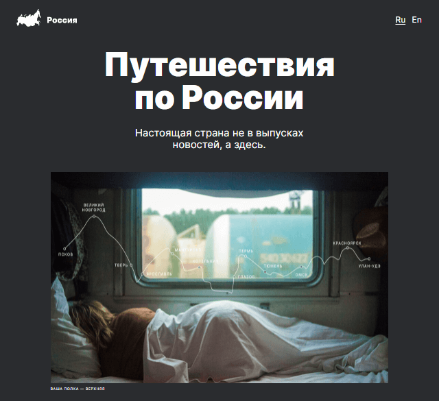

# Проект: Путешествие по России
---
***Содержание файла README.md***

 
<a href="#description">Описание</a>
 
<a href="#figma">Ссылка на макет в Figma</a>
 
<a href="#demo">Демонстрация</a>
 
<a href="#file_structure">Файловая структура</a>
 
<a href="#technologies">Использованные технологии</a>

 
<h2>Описание</h2>

Данный проект реализован в рамках курсов от Яндекс.Практикум и представляет собой типовой одностраничный сайт о путешествии по России. Для реализации используется дизайн-макет в Figma.

 
<h2>Ссылка на макет в Figma</h2> 
 

В Фигме размещен <a href="https://ru.bem.info/methodology/filestructure/">макет</a>, в котором видно, как проект должен выглядеть на самых распространённых разрешениях экранов (320, 768, 1024 и 1280 пикселей).

<h2>Демонстрация</h2> 

Ссылка на сайт <a href="https://almatanastasia.github.io/russian-travel/">тут</a> !
 

<h2>Файловая структура</h2> 
<pre>
.
├── blocks          # Файлы стилей блоков 
├── fonts           # Файлы шрифтов 
├── images          # Файлы изображений 
├── pages           # Файлы стилей страниц 
├── vendor          # Файлы сторонних библиотек 
├── .nojekyll       # Пустой файл для публикации на GitHub Pages 
├── README.md       # Файл документации проекта 
└── index.html      # Главная страница сайта 
</pre>

<h2>Использованные технологии</h2> 

⬥ Работа с макетом в Figma 
⬥ Расширенные возможности HTML и CSS  
⬥ Построение сложных сеток (Flexbox и Grid Layout) 
⬥ Медиазапросы 
⬥ Технологии адаптивной верстки 
⬥ Файловая структура CSS по методолгии БЭМ (Nested) 

**Картинки**

Перед публикацией необходимо [оптимизировать картинки](https://tinypng.com/), чтобы сайт загружался быстрее.
